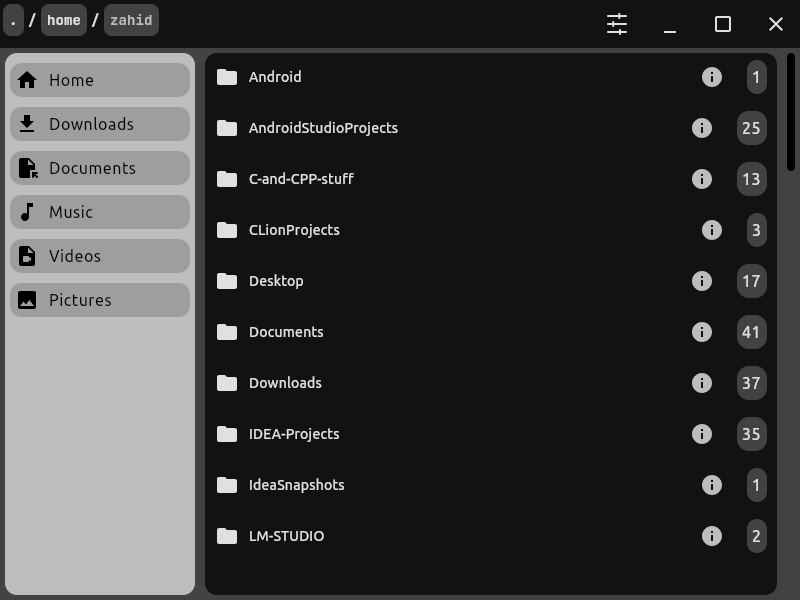
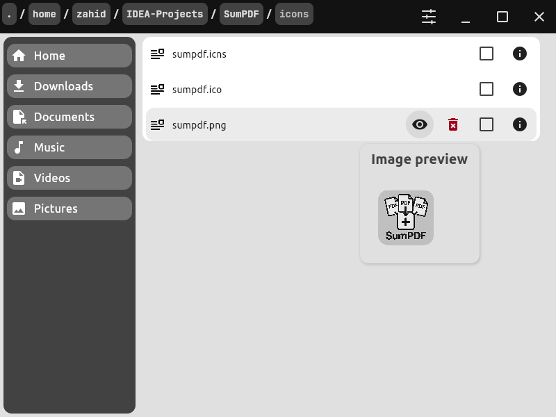

# Filer

A modern file manager desktop application built with Kotlin and Compose for Desktop, featuring a clean Material 3 interface.

[](https://kotlinlang.org) [](https://www.jetbrains.com/lp/compose-multiplatform/)

## Screenshots




## Demo videos

1. [demo1](https://github.com/user-attachments/assets/99251956-6162-499e-a6a7-8e36f7fb9096)
2. [demo2](https://github.com/user-attachments/assets/e9f8ec37-a4e3-4e86-891a-b0d52f8d26f6)

## Features

- **File Management**
    - Browse files and folders with a clean interface
    - Multi-file selection for batch operations
    - Delete files
    - Open files with default system applications
    - View detailed file/folder information (size, type, modified date)

- **Navigation**
    - Quick access sidebar for common folders (Home, Downloads, Documents, Music, Videos, Pictures)
    - Breadcrumb path navigation
    - Folder content count display

- **User Interface**
    - Material 3 design system
    - Dark and light theme support with persistent settings
    - Custom window chrome with minimize/maximize/close controls
    - Animated settings icon
    - Image preview tooltips for image files (only `png`, `jpg`, `jpeg`)
    - Smooth animations and transitions

- **Settings**
    - Toggle hidden files visibility
    - Theme preference persistence
    - Settings stored in `~/.filer/settings.json`


## Development Setup

### Prerequisites

- JDK 17 or later
- Kotlin 2.1.20 or later
- IntelliJ IDEA (recommended) or Android Studio

### Make Gradle Wrapper Executable (Linux/macOS only)

After cloning the repository, make the Gradle wrapper executable:
```bash
chmod +x gradlew
```

### Running the Application

#### Standard Run
```bash
./gradlew run
```

#### Hot Reload (Recommended for Development)
```bash
./gradlew :hotRun --mainClass Filer --auto
```

This enables automatic recompilation and hot swapping when you modify your code.

### Building Native Distributions

#### Build for Current Platform
```bash
./gradlew packageDistributionForCurrentOS
```

#### Platform-Specific Builds
- **Windows**: `./gradlew packageMsi` or `./gradlew packageExe`
- **macOS**: `./gradlew packageDmg`
- **Linux**: `./gradlew packageDeb`

#### Linux Debian Package with Enhanced Features
For Linux users, there's a special task that creates a Debian package with proper desktop integration:
```bash
./gradlew packageDebWithWMClass
```

This task adds:
- Proper StartupWMClass for dock grouping
- Terminal command support (`filer` command)
- Enhanced desktop menu integration

### Available Gradle Tasks

- `./gradlew run` - Run the application
- `./gradlew :hotRun --mainClass Filer --auto` - Run with hot reload
- `./gradlew clean` - Clean build artifacts
- `./gradlew packageDistributionForCurrentOS` - Build for current OS
- `./gradlew packageReleaseDeb` - Build optimized Debian package
- `./gradlew generateUpgradeUuid` - Generate UUID for Windows MSI updates

## TODO

- add Favorites section in nav bar
- add Recents section in nav bar

## Generated with Compose for Desktop Wizard

This project was generated using the [Desktop Client of Compose for Desktop Wizard](https://github.com/zahid4kh/compose-for-desktop/tree/desktop).